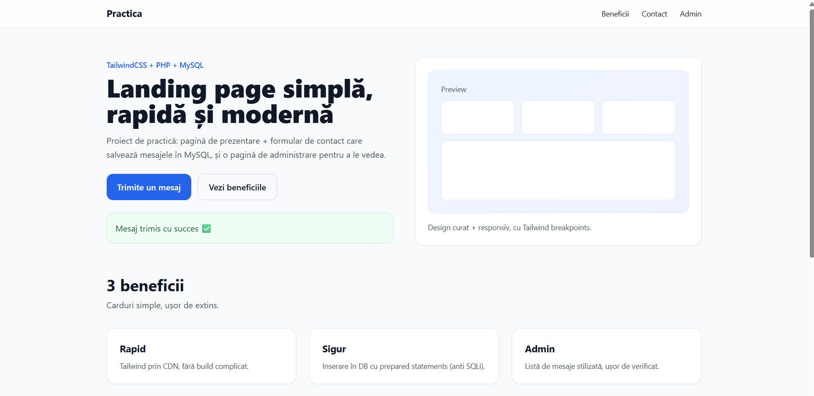
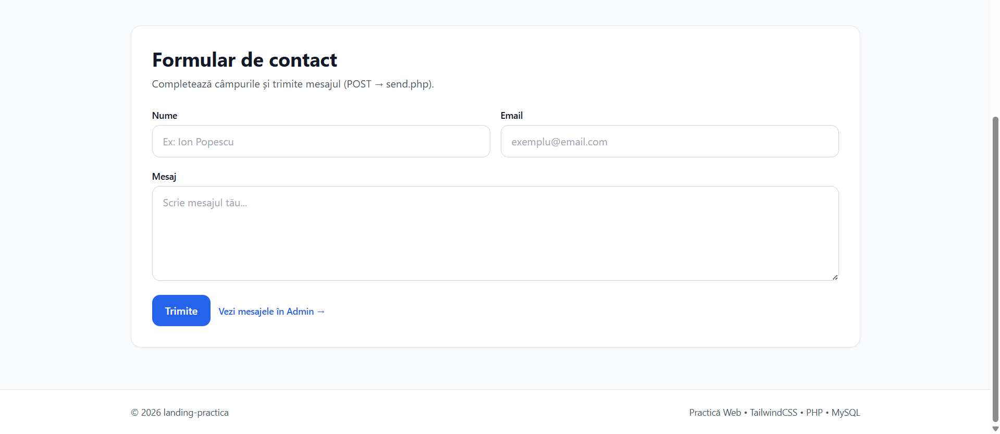
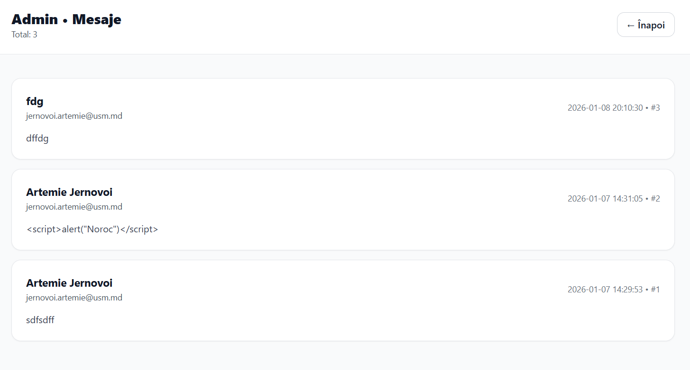

Proiect: Landing Practică (TailwindCSS + PHP + MySQL)
---------------------------------------------------

Descriere:
- Landing page cu secțiuni: Navbar, Hero, Beneficii, Footer
- Formular de contact (POST) care salvează mesajele în MySQL
- Pagină Admin care afișează mesajele

Tehnologii:
- PHP
- MySQL (XAMPP)
- TailwindCSS (CDN)

Pași de rulare:
1) Pornește XAMPP: Apache + MySQL
2) Creează baza de date "practica" și tabelul "messages"
3) Pune folderul proiectului în: C:\xampp\htdocs\practica
4) Deschide:
   - http://localhost/practica/index.php
   - http://localhost/admin.php

Opțional:
- Capturi de ecran (index + admin)

